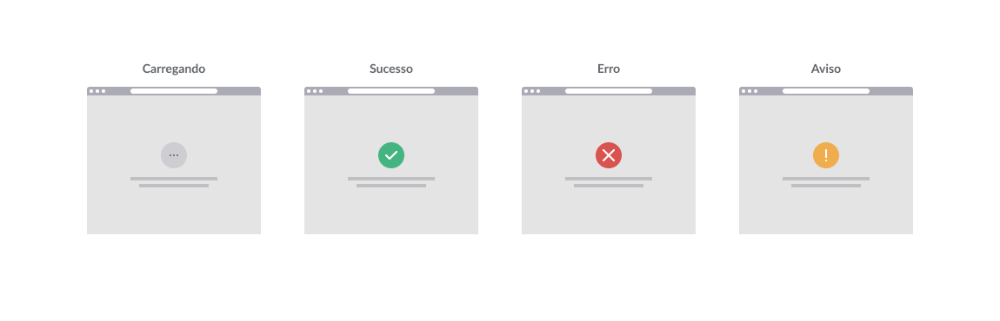

# Documentação do Projeto – Simulação de VUI para Busca e Filtragem – Empresa XPTO
## Grupo 06 - The Guys

## 1. Introdução

Este projeto consiste no desenvolvimento de uma simulação de **assistente virtual com interface de voz (VUI – Voice User Interface)** voltado para a busca e filtragem de informações da empresa XPTO.

O objetivo é permitir que o usuário realize pesquisas por meio de comandos de voz, tornando o processo mais acessível, rápido e intuitivo.

---

## 2. Decisões de Design

### 2.1 Fluxo de Interação

O fluxo foi pensado para seguir uma lógica simples e linear, com possibilidade de ramificações conforme a intenção do usuário:

* **Início** – O usuário acessa a Página Inicial e é orientado a falar o comando desejado.
* **Entrada de Comando de Voz** – O assistente reconhece o comando e inicia o processamento.
* **Feedback Auditivo** – O sistema confirma os filtros e/ou termos de busca aplicados.
* **Exibição de Resultados** – Resultados filtrados são exibidos e, quando necessário, o assistente sugere comandos adicionais.
* **Encerramento ou Nova Consulta** – O usuário pode finalizar ou refinar a busca.

### 2.2 Comandos de Voz Identificados

Foram mapeados comandos como:

* `"Buscar [termo]"` → para pesquisas diretas.
* `"Filtrar por [categoria]"` → para aplicar filtros.
* `"Mostrar resultados recentes"` → para atualizações rápidas.
* `"Limpar filtros"` → para redefinir a busca.
* `"Ajuda"` → para listar comandos possíveis.

### 2.3 Diálogos Possíveis

* **Exemplo – Cenário de Busca:**
    * **Usuário:** "Buscar relatórios financeiros de 2023"
    * **Assistente:** "Buscando relatórios financeiros de 2023… Encontrados 5 resultados."
* **Exemplo – Cenário de Filtragem:**
    * **Usuário:** "Filtrar por área de marketing"
    * **Assistente:** "Filtro aplicado: área de marketing."

---

## 3. Desenho da Interface de Voz

### 3.1 Wireframes Desenvolvidos

**Alertas:**
* **Carregando:** indicação visual de processamento.
* **Sucesso:** ação concluída com êxito.
* **Erro:** falha na execução ou reconhecimento de comando.
* **Aviso:** necessidade de ajuste ou confirmação do usuário.

**Simulador:**
* **Página Inicial:** botão de microfone para iniciar a gravação.
* **Resumo Transcrito:** mostra a interpretação textual do comando de voz.
* **Comandos Possíveis:** lista de exemplos de interações aceitas pelo sistema.

### 3.2 Feedback Auditivo

Foi implementada a repetição dos filtros aplicados ou do termo de busca antes da execução da consulta, para confirmar a intenção do usuário.

Em caso de erro ou dúvida, o assistente informa e solicita que o comando seja repetido.

---

## 4. Dificuldades Enfrentadas

* **Reconhecimento de voz:** necessidade de tratar ruídos e evitar interpretações incorretas.
* **Mapeamento de intenções:** alguns comandos de voz podem ter múltiplos significados.
* **Integração visual e auditiva:** garantir que as mensagens na tela e no áudio sejam consistentes.

---

## 5. Soluções Propostas

* Implementar filtros de ruído e palavras-chave específicas para reduzir ambiguidades.
* Criar fluxos de _fallback_, solicitando confirmação quando o comando não for claro.
* Sincronizar feedback visual e sonoro para melhor acessibilidade.

---

## 6. Sugestões de Melhorias Futuras

* Adicionar aprendizado de máquina para adaptação a padrões de fala do usuário.
* Incluir multi-idiomas para ampliar o público-alvo.
* Implementar atalhos de voz personalizados para comandos frequentes.
* Integrar com bancos de dados em tempo real para respostas mais rápidas.

---

## 7. Conclusão

O protótipo cumpre o objetivo proposto, oferecendo uma simulação funcional de assistente virtual baseado em voz para busca e filtragem de dados da empresa XPTO.

A experiência combina facilidade de uso, acessibilidade e agilidade, sendo um bom ponto de partida para uma implementação completa no futuro.

## 8. Deploy
Segue link de acesso para o protótipo funcional. Algumas alterações de design precisaram ser feitas em relação aos wireframes para se adequar ao escopo da solução:
https://assistente-virtual-x-cddq.bolt.host/
